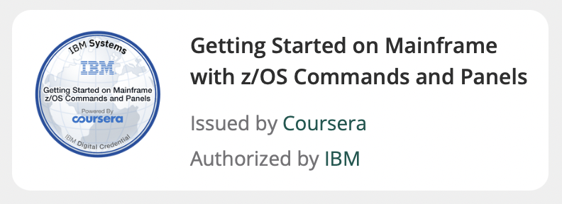

Hi there 👋 I'm Rakesh  
<!--
 

<!-- OctoCats--!>

 
  
                     

<!-- OctoCats 

 

- 🔭 I’m currently working on **iOS Development**
- 🌱 I’m currently learning **SwiftUI**
- 👯 I’m looking to collaborate on **openSource**
- 💬 Ask me about anything i can help you with [Support](https://github.com/mahatorakesh/Support)
- 📫 How to reach me [Twitter](https://twitter.com/rakeshmahatto)
- 😄 Pronouns: **he/him**
- ⚡ Fun fact: **Enjoy every moments** -->

<!-- ## ⚡ Tech Stack
### Language :

### Libraries & Framework :

### DevOps & Cloud Tools:

### IDEs/Editors

 ## 💰 Support

 -->

